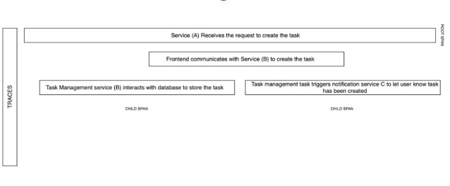

## **Introduction**

Distributed tracing is a method to track the flow and timing of application requests as they move through a system of components such as browsers, APIs, Databases and other infrastructure such as queues, data stores. The key idea is to link and trace requests across multiple services in a distributed architecture, which enables a comprehensive understanding of how a request progresses through various components, aiding in troubleshooting and optimizing the overall performance of the entire application stack.

## **How Distributed Tracing Works**

There are mainly two components of tracing. Traces and spans. A trace represents the entire log of events that took place during a request, from initiation to completion. Each trace is composed of multiple spans. A span is a specific operation or task that contributes to the processing of a request, such as performing a database query or authentication. An initial request will create a root span. Root span, encapsulates the entire time taken for a request to be completed. If the initial request requires additional operations, the root span will create additional child spans, which can also create their own spans.

**For example, consider an application that lets a user add tasks.**

<!-- img  -->

## **Conclusion**

In the context of a task list application, this simplified example demonstrates how distributed tracing could be employed to visualize the user's actions, such as adding and completing a task, as they traverse through different services. The trace context, including unique identifiers like trace and span IDs, helps correlate related spans, providing a comprehensive view of the end-to-end journey of a request. Distributed tracing is not only a powerful tool for troubleshooting and debugging but also a key component of observability in modern, complex systems. It allows development and operations teams to identify inefficiencies, optimize critical paths, and ensure a smooth and responsive user experience.

Platforms supporting Distributed Tracing functionality will be discussed in more detail in a subsequent blog.

## **References**

[Distributed tracing](https://www.datadoghq.com/knowledge-center/distributed-tracing)

[Distributed tracing and observability](https://www.dynatrace.com/news/blog/open-observability-distributed-tracing-and-observability/)
