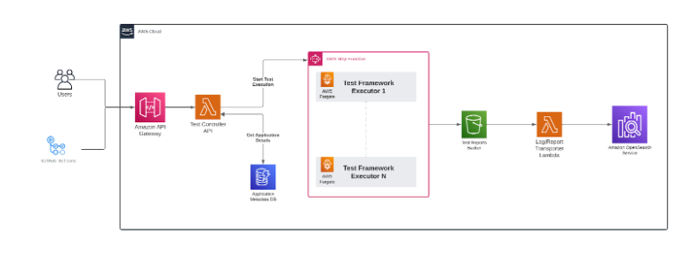

# **Introduction**

Testing plays an indispensable role in the software development lifecycle of any product or application by validating its reliability and functionality. However, traditional testing models are often dependent on infrastructure provisioning, leading to slower development and testing cycles. With the advent of serverless architectures, there has been a recent paradigm shift in test automation capabilities, freeing up development and testing teams from the complexities of infrastructure provisioning. Based on a customer requirement, our recent journey into Serverless Test Automation on AWS represents a pivotal moment where we seamlessly integrated various serverless services to create a testing platform that is scalable and can be centrally managed for improved efficiencies.

# **Serverless Test Automation Platform**

KansoCloud staff harnessed the power of AWS serverless services to create an efficient and scalable testing solution for one of our customers. The next few sections provide additional details on how AWS serverless services were integrated to develop a dynamic testing platform that extends beyond test execution by providing valuable insights through reporting features.

<!-- Image will be presented here -->

# **Scalable Test Execution with AWS StepFunctions and Fargate on ECS**

This scalable testing platform is powered by Fargate on ECS, which is orchestrated and provisioned through StepFunctions on AWS. This combination of Fargate and StepFunctions allowed us to dynamically scale our testing infrastructure based on the demands of the development environment. A StepFunction was created to monitor test runs as it spins up our custom-built Docker Container Executors on ECS Fargate to run the user's choice of test framework (Robot Framework, TOSCA, Selenium, Load Runner, etc.). These executors capture all the basic reports generated by the test frameworks and store them in an S3 bucket for future use.

# **Dynamic Test Execution: API Integrations**

The new platform offers multiple endpoints that can be used to integrate with other CI/CD tools available in the customer ecosystem. It also captures detailed reports and metrics, giving a comprehensive view of their test results to every product team using the platform. The integrated metrics such as test benchmarks, success/failure rates thresholds, testing categories, and types provides product owners with valuable insights, enabling them to make data-driven decisions and improve their internal testing processes.

# **Centralized Reporting: Dashboards for Test Usage Metrics**

The new platform was built leveraging the capabilities of AWS OpenSearch to provide an efficient and user-friendly interface for viewing logs and test execution metrics. The reports (stored in S3), are used by the platform to generate metrics and fed into OpenSearch for further use in Dashboards. These dashboards offer a comprehensive view of the testing landscape, enabling product owners and developers to quickly identify issues and/or areas of improvement. The platform has also been integrated with Amazon CloudWatch to monitor the health of the overall test infrastructure.

# **Empowering Users: Downloadable Test Reports**

The platform enables downloading of comprehensive reports generated every time a test suite is executed by a product team. This user-friendly feature enhances collaboration and provides stakeholders with detailed information for analysis and decision-making. The platform also enables users to schedule automated tests, set up email notifications, and define custom configurations for test execution based on specific parameters.

# **Conclusion**

The new serverless architecture based testing platform, coupled with the native orchestration capabilities of AWS services, creates a seamless environment that balances flexibility with scalability, reliability, and maintainability. Our journey into serverless test automation on AWS has resulted in the development of a dynamic and scalable testing platform that goes beyond test execution, by providing users with valuable insights through easily available reporting features. With the power of Terraform, we were able to automate the deployment of the infrastructure, thereby making it easy to manage and maintain the infrastructure supporting the platform. While development of this platform did take a lot of thinking through options and working through issues, it is a testament to our commitment to innovation and excellence in the field of software development and automated testing.
